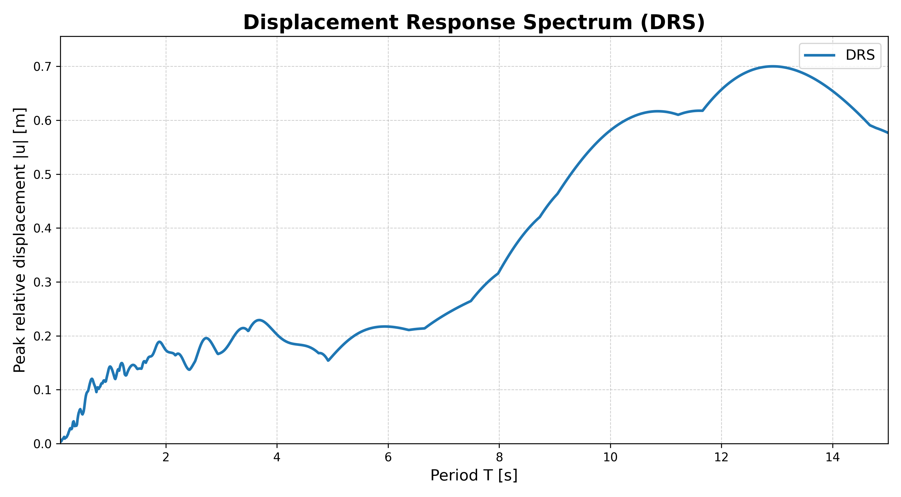
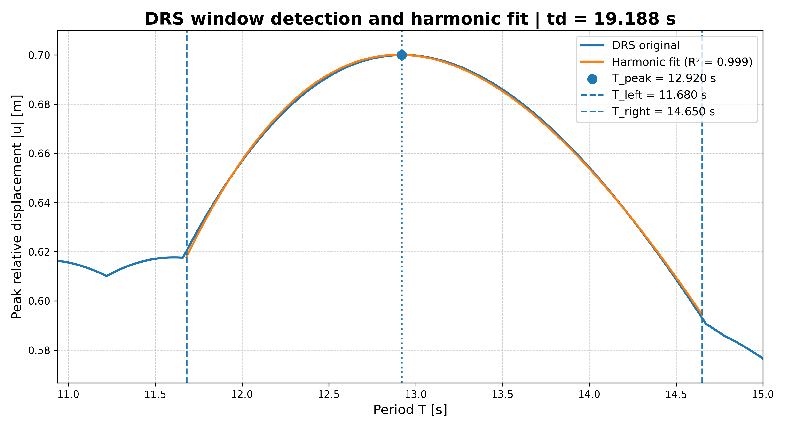
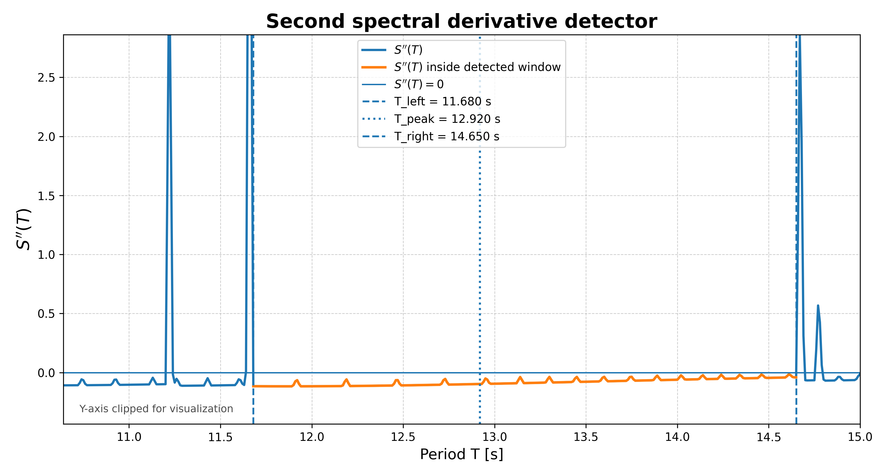

# SPECduration

SPECduration is an open-source Python package for estimating spectral seismic duration from displacement response spectra (DRS).

The software computes the displacement response spectrum of an earthquake acceleration record, automatically identifies the dominant spectral window using the second derivative of the spectrum, and performs harmonic fitting within the detected window to estimate a spectral duration parameter.

SPECduration is designed for reproducible and non-interactive seismic record analysis. It avoids manual selection of the fitting interval and generates standardized numerical and graphical outputs for individual or batch-processing workflows.

---

# Table of Contents

- [Scientific background](#scientific-background)
- [Features](#features)
- [Installation](#installation)
- [Usage](#usage)
- [Input format](#input-format)
- [Output structure](#output-structure)
- [Example output](#example-output)
- [Interpretation of results](#interpretation-of-results)
- [Methodological workflow](#methodological-workflow)
- [Reproducibility](#reproducibility)
- [License](#license)
- [Citation](#citation)

---

# Scientific background

The method implemented in SPECduration is based on the observation that displacement response spectra (DRS) of pulse-type and near-fault ground motions may exhibit smooth harmonic-like regions around predominant spectral peaks.

This harmonic behavior is associated with residual response spectra produced by finite-duration or pulse-like shock excitations, where sinusoidal forms can appear in the spectral response. Based on this theoretical basis, SPECduration approximates the predominant DRS region using the harmonic model:

$$
R(T) = A \left| \sin\left(\frac{\pi t_d}{T} + \varphi \right) \right|
$$

where:

- $R(T)$ is the displacement response spectrum,
- $A$ is the spectral amplitude,
- $t_d$ is the characteristic spectral duration,
- $T$ is the structural period,
- $\varphi$ is the phase parameter.

SPECduration implements this DRS-based spectral-duration estimation in the period domain. The software computes the displacement response spectrum \(S(T)\), identifies the peak period \(T_p\), and uses the second derivative \(S''(T)\) to detect the dominant negative-curvature region around the main spectral lobe. The internal limits of this region define the fitting window \([T_l,T_r]\).

The default workflow uses a damping ratio of 5% and a spectral resolution of:

$$
\Delta T = 0.01 \ \text{s}
$$

This resolution is adopted to preserve the local DRS geometry required for second-derivative-based window detection.

---

# Features

- Displacement Response Spectrum (DRS) computation using the Newmark-β method
- Automatic identification of the peak period \(T_p\)
- Numerical computation of the first and second derivatives, \(S'(T)\) and \(S''(T)\)
- Curvature-based detection of the dominant spectral window \([T_l,T_r]\)
- Harmonic fitting of the DRS within the detected window
- Estimation of the spectral duration parameter \(t_d\)
- Calculation of goodness-of-fit using \(R^2\)
- Automatic validation of fitting results
- Generation of reproducible CSV outputs and diagnostic figures
- Command-line interface for individual or batch-processing workflows
- Deterministic analysis without manual window selection

---

# Installation

## Requirements

- Python ≥ 3.9

## Install from source

```bash
pip install -e .

```
## Usage

Run the software from the command line:

```bash
specduration --input examples/ChiChi_Taichung78_90.txt --out outputs

```
### Command-line options

- `--input` : Path to the ground-motion record (`.txt`)
- `--out` : Output directory
- `--no-plots` : Disable figure generation

## Input format

The input file must be a plain-text file with two columns:

1. Time, in seconds 
2. Ground acceleration, in m/s²

**Example:**

```text
t(s)    ag(m/s^2)
0.00    -0.00123
0.02     0.00345
0.04    -0.00210
...

```
## Output structure

For each processed record, **SPECduration** creates a dedicated output folder inside
the directory specified with `--out`. The folder contains numerical summaries and
diagnostic figures.

The main output files are:

- `drs_full.csv` — Full displacement response spectrum values
- `second_derivative.csv` — Numerical second-derivative values used for window detection
- `results.csv` — Summary of the estimated parameters and validation metrics
- `results_diagnostics.csv` — Additional diagnostic information from the detection and fitting workflow
- `drs_full.png` — Complete DRS figure
- `drs_window.png` — Detected spectral window with harmonic fit
- `second_derivative_window.png` — Second-derivative diagnostic plot used for window detection

The `results.csv` file includes:

- peak period `Tp`
- left window limit `Tl`
- right window limit `Tr`
- number of fitting points `n`
- estimated spectral duration `td`
- coefficient of determination `R2`
- validation status

### Example output

Below is an example of the diagnostic outputs generated by **SPECduration** for a
near-fault ground-motion record.

#### Displacement Response Spectrum



#### Detected spectral window and harmonic fit



#### Second-derivative diagnostic plot



## Interpretation of results

The estimated parameter \(t_d\) represents a spectral measure of seismic duration derived from the geometry of the displacement response spectrum.

Unlike conventional time-domain duration metrics, SPECduration estimates duration from the predominant spectral region of the DRS. Therefore, \(t_d\) should be interpreted as a response-spectrum-based duration descriptor, not as a direct replacement for bracketed, significant, or threshold-based time-domain measures.

The coefficient of determination \(R^2\) indicates how well the harmonic model reproduces the local DRS geometry inside the detected window. The number of fitting points \(n\) and the validation status help assess whether the detected window contains enough spectral information for a stable fit.

---

## Methodological workflow

The workflow implemented in SPECduration consists of the following steps:

1. Load the earthquake acceleration record from a plain-text file.

2. Compute the displacement response spectrum \(S(T)\) using the Newmark-β method.

3. Identify the peak period \(T_p\) from the maximum value of the DRS.

4. Compute the first and second numerical derivatives, \(S'(T)\) and \(S''(T)\).

5. Detect the dominant spectral window \([T_l,T_r]\) by identifying the negative-curvature region around \(T_p\).

6. Fit the harmonic model:

   $$
   S(T) = A \left| \sin\left(\frac{\pi t_d}{T} + \varphi \right) \right|
   $$

7. Estimate the spectral duration parameter \(t_d\) and the goodness-of-fit value \(R^2\).

8. Validate the result using the internal fitting and window-quality criteria.

9. Export tabular results and diagnostic figures.

## Reproducibility

SPECduration is designed to produce deterministic and reproducible results. Given the same input record and software version, the package generates the same DRS, detected window, fitted parameters, validation status, and diagnostic figures.

The workflow avoids manual intervention during the selection of the fitting window, which supports reproducible analysis of individual records and batch processing of multiple ground-motion records.

## License

This project is released under the MIT License.

## Citation

If you use this software in academic work, please cite it using the information provided in the `CITATION.cff` file.


