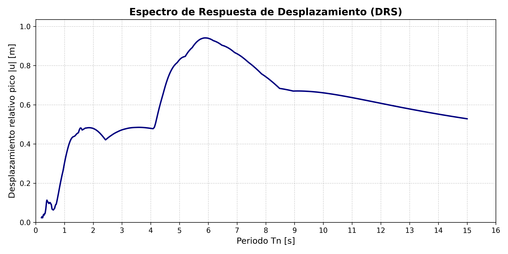
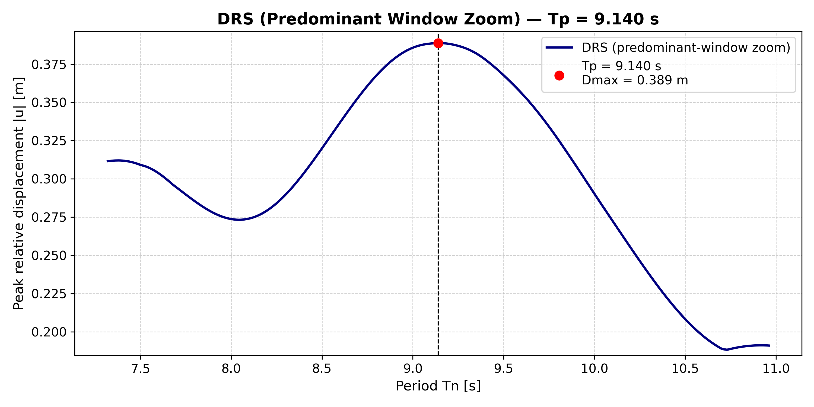
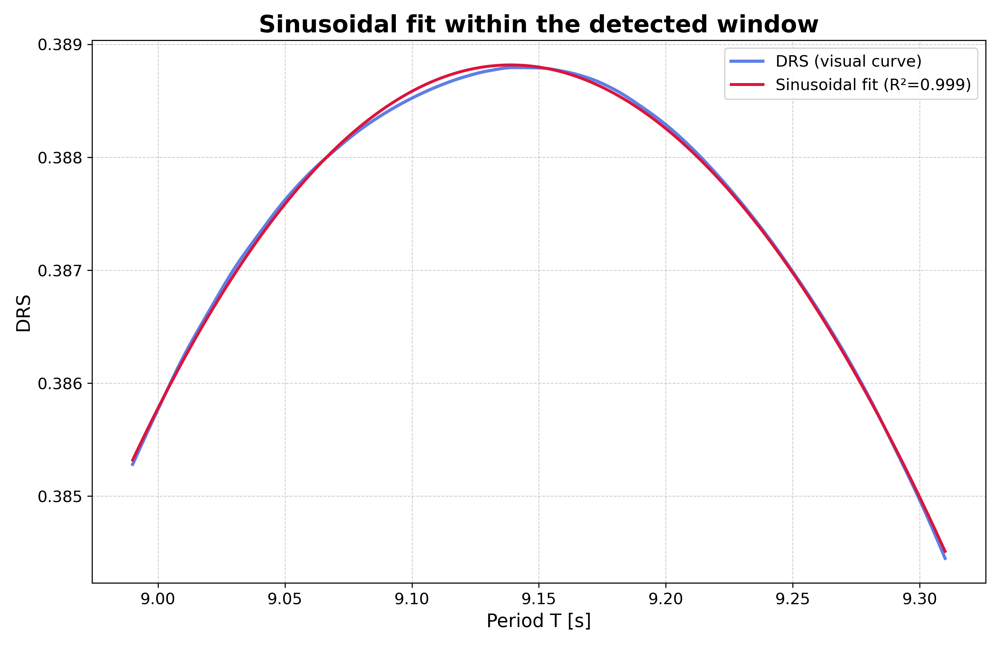

# drs-duration

drs-duration is a Python package for estimating seismic duration from the Displacement Response Spectrum (DRS).

The method is based on the observation that high-resolution DRS obtained from impulsive and near-fault ground motions exhibit smooth harmonic-like segments, reflecting residual oscillatory behavior associated with pulse-dominated response in SDOF systems.

Instead of using time-domain thresholds, the software estimates a spectral duration parameter by automatically identifying the predominant region of the DRS and performing a nonlinear sinusoidal fit.

The workflow is fully automatic and reproducible, combining robust derivative-based spectral window detection, operational alpha stabilization, restricted adaptive search, and auxiliary envelope-based fallback for complex spectral geometries.

---

# Table of Contents

- [Scientific background](#scientific-background)
- [Features](#features)
- [Installation](#installation)
- [Usage](#usage)
- [Input format](#input-format)
- [Output structure](#output-structure)
- [Example output](#example-output)
- [Interpretation of results](#interpretation-of-results)
- [Methodological workflow](#methodological-workflow)
- [Reproducibility](#reproducibility)
- [License](#license)
- [Citation](#citation)

---

# Scientific background

The method is based on the observation that displacement response spectra (DRS) obtained from impulsive and near-fault ground motions may exhibit smooth harmonic-like regions across the spectrum.

Within these regions, the spectral shape can be approximated by a sinusoidal model of the form:

$$
R(T) = A \left| \sin\left(\frac{\pi t_d}{T} + \varphi \right) \right|
$$

where:

- $R(T)$ is the displacement response spectrum,
- $A$ is the spectral amplitude,
- $t_d$ is the characteristic spectral duration,
- $T$ is the structural period,
- $\varphi$ is the phase parameter.

The predominant spectral region is identified automatically using a robust derivative-based criterion centered around the dominant DRS peak.

To improve robustness against local irregularities and isolated gradient peaks, the derivative threshold is defined using a percentile-based reference:

$$
\left| \frac{dR}{dT} \right|
\leq
\alpha \cdot P95\left(\left| \frac{dR}{dT} \right|\right)
$$

where:

- $\alpha$ is an operational control parameter,
- $P95$ denotes the 95th percentile of the absolute derivative values in the vicinity of the spectral peak.

Sensitivity analyses performed over multiple near-fault records showed that intermediate operational values of $\alpha$ produce stable and physically coherent spectral windows while avoiding excessively narrow or overextended regions.

The final workflow therefore adopts:

$$
\alpha = 0.30
$$

as the default operational value, together with restricted adaptive search and auxiliary fallback stabilization for complex cases.

---

# Features

- High-resolution Displacement Response Spectrum (DRS) computation using the Newmark-β method
- Robust derivative-based detection of the predominant spectral region
- Operational alpha strategy for stable automatic window selection
- Restricted adaptive alpha search for complex spectral cases
- Auxiliary envelope-based fallback stabilization
- Automatic physical validation of fitted solutions
- Nonlinear sinusoidal fitting of spectral duration
- Generation of reproducible diagnostic figures and CSV outputs
- Command-line interface (CLI) for automated and batch processing
- Deterministic and reproducible workflow

---

# Installation

## Requirements

- Python ≥ 3.9

## Install from source

```bash
pip install -e .

```
## Usage

Run the software from the command line:

```bash
drs-duration --input examples/ChiChi_Taichung78_90.txt --out outputs

```
### Command-line options

- `--input` : Path to the ground-motion record (`.txt`)
- `--out` : Output directory
- `--no-plots` : Disable figure generation

## Input format

The input file must be a plain text file with two columns:

1. Time (s)
2. Ground acceleration (e.g., m/s²)

**Example:**

```text
t(s)    ag(m/s^2)
0.00    -0.00123
0.02     0.00345
0.04    -0.00210
...

```
## Output structure

For each processed record, **drs-duration** creates a dedicated subfolder inside
the output directory (specified with `--out`). The subfolder contains:

- `drs_full.csv` — Full displacement response spectrum
- `drs_full.png` — Full DRS figure
- `drs_zoom.png` — Zoomed DRS around the detected harmonic window
- `alpha_scan.csv` — α-scan results
- `r2_vs_alpha.png` — R² versus α plot
- `sine_fit.png` — Final sinusoidal fit within the detected window
- `results.csv` — Summary of estimated parameters

### Example output

Below is an example of the outputs generated by **drs-duration** for a
near-fault ground motion record.

#### Displacement Response Spectrum


#### Detected predominant spectral region


#### Final sinusoidal fitting


## Interpretation of results

The estimated parameter $t_d$ represents a spectral measure of seismic duration derived from the geometry of the displacement response spectrum.
Unlike traditional time-domain duration metrics, the proposed approach operates entirely in the spectral domain and is less sensitive to:

- low-amplitude signal tails,
- isolated late peaks,
- and threshold-dependent truncation effects.

The methodology focuses on identifying physically coherent spectral regions associated with the predominant dynamic response of the system.

## Methodological workflow

The final workflow implemented in drs-duration is:

1. Computation of the high-resolution DRS using Newmark-β integration

2. Detection of the predominant spectral peak

3. Robust derivative-based window identification using:

   - operational alpha:
     
   α = 0.30

4. Physical validation of the detected window:

   - $R^2 \geq 0.95$
   - sufficient window size
   - physically admissible duration

5. Restricted adaptive alpha search:

   0.20 ≤ α ≤ 0.50

   only if the operational configuration fails

6. Auxiliary envelope-based fallback stabilization for complex spectra

7. Nonlinear sinusoidal fitting and final duration estimation

## Reproducibility

All results are deterministic and reproducible.
Given the same input record and command-line configuration, drs-duration generates identical outputs and figures.
The workflow avoids manual intervention during spectral window selection.

## License

This project is released under the MIT License.

## Citation

If you use this software in academic work, please cite it using the information provided in the `CITATION.cff` file.


