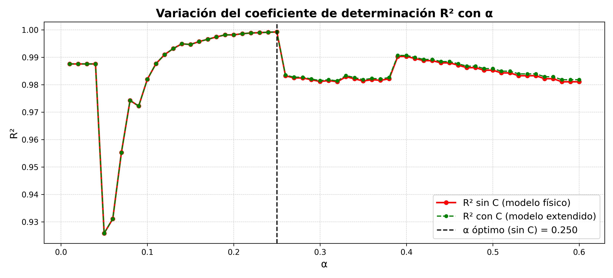

# drs-duration

drs-duration is a Python package for estimating seismic duration from the
harmonic structure of the Displacement Response Spectrum (DRS).

The method is based on a physically grounded observation: high-resolution DRS
curves derived from impulsive and near-fault ground motions exhibit **smooth and
harmonic-like segments across the spectrum**, reflecting the free oscillatory
response of SDOF systems subjected to impulsive excitation.

Instead of relying on time-domain energy thresholds, drs-duration estimates a
spectral-based duration parameter by automatically identifying the
predominant harmonic window of the DRS and performing a nonlinear sinusoidal fit
within that region.

The entire procedure is fully automatic, objective, and reproducible, and can
be executed through a single command-line instruction.

---

# Table of Contents
- [Scientific background](#scientific-background)
- [Features](#features)
- [Installation](#installation)
- [Usage](#usage)
- [Input format](#input-format)
- [Output structure](#output-structure)
- [Example output](#example-output)
- [Interpretation of results](#interpretation-of-results)
- [Reproducibility](#reproducibility)
- [License](#license)
- [Citation](#citation)

---

## Scientific background

The proposed approach exploits the fact that the residual response of an SDOF
system subjected to impulsive excitation inherently contains terms of the form:

$$
R(T) = A \left| \sin\left(\frac{\pi t_d}{T} + \varphi \right) \right|
$$

where $t_d$ represents a characteristic duration parameter and $T$ is the
structural period. This mathematical structure explains the appearance of
harmonic-like geometries in displacement response spectra, particularly in
near-fault records dominated by strong velocity pulses.

To account for small vertical biases that may arise from numerical discretization
or spectral processing, an extended model including a constant offset is also
considered:

$$
R(T) = A \left| \sin\left(\frac{\pi t_d}{T} + \varphi \right) \right| + C
$$

The constant $C$ has **no physical meaning** and acts solely as a numerical
corrector.

---

## Features

- Computation of Displacement Response Spectrum (DRS) using Newmark-β integration  
- Automatic detection of the predominant harmonic window around the DRS peak  
- Derivative-based criterion with robust fallback strategies  
- Systematic α-scan to select the optimal derivative threshold  
- Nonlinear sinusoidal duration fitting, with and without constant offset  
- Generation of publication-ready figures  
- Fully automated command-line interface (CLI) for batch processing  
- Reproducible outputs (CSV tables and PNG figures)

---

## Installation

### Requirements

- Python ≥ 3.9

### Install from source (recommended for research)

```bash
pip install -e .

```
## Usage

Run the software from the command line:

```bash
drs-duration --input examples/San_Fernando_en_metros.txt --out outputs

```
### Command-line options

- `--input` : Path to the ground-motion record (`.txt`)
- `--out` : Output directory
- `--no-plots` : Disable figure generation (tables only)

## Input format

The input file must be a plain text file with two columns:

1. Time (or time step) in seconds  
2. Ground acceleration (e.g., in m/s²)

**Example:**

```text
t(s)    ag(m/s^2)
0.00    -0.00123
0.02     0.00345
0.04    -0.00210
...

```
## Output structure

For each processed record, **drs-duration** creates a dedicated subfolder inside
the output directory (specified with `--out`). The subfolder contains:

- `drs_full.csv` — Full displacement response spectrum
- `drs_full.png` — Full DRS figure
- `drs_zoom.png` — Zoomed DRS around the detected harmonic window
- `alpha_scan.csv` — α-scan results
- `r2_vs_alpha.png` — R² versus α plot
- `sine_fit.png` — Final sinusoidal fit within the detected window
- `results.csv` — Summary of estimated parameters

### Example output

Below is an example of the outputs generated by **drs-duration** for a
near-fault ground motion record.

#### Displacement Response Spectrum


#### Predominant harmonic window


#### α-scan and goodness-of-fit


#### Final sinusoidal fitting


## Interpretation of results

The estimated duration parameter $t_d$ represents a spectral-based measure of
effective seismic duration derived from the harmonic structure of the DRS.
Unlike traditional time-domain duration metrics, this parameter is less
sensitive to weak energy tails, late secondary peaks, and noise contamination.

The constant-offset model is included for numerical robustness only. The
parameter $C$ has no physical interpretation.


## Reproducibility

All results are fully reproducible. Given the same input record and command-line
options, the software will generate identical outputs.


## License

This project is released under the MIT License.


## Citation

If you use this software in academic work, please cite it using the information
provided in the `CITATION.cff` file included in this repository.


