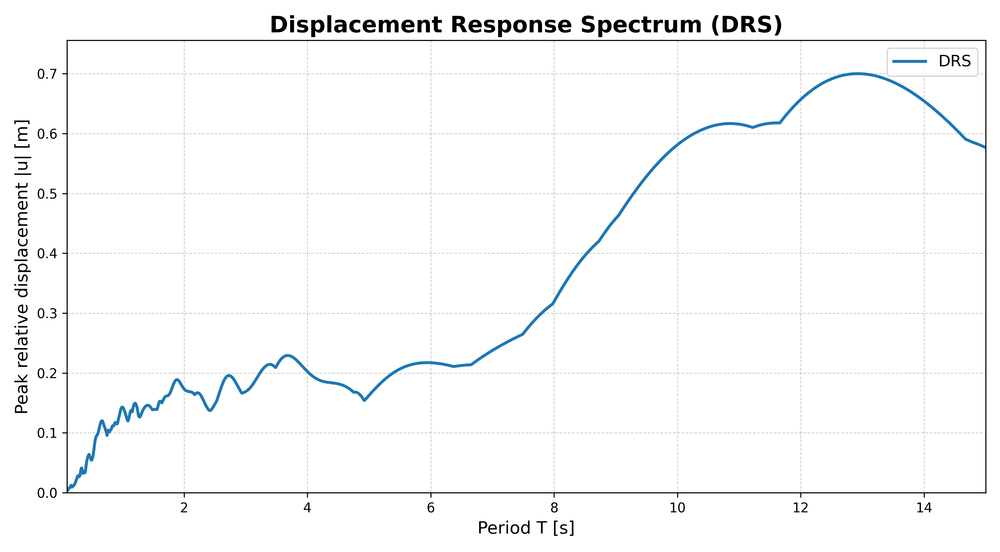
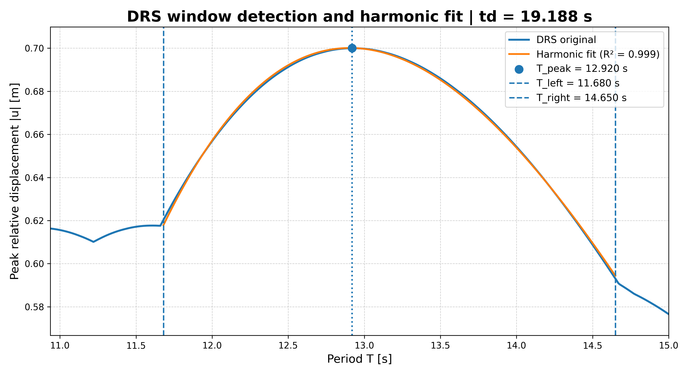
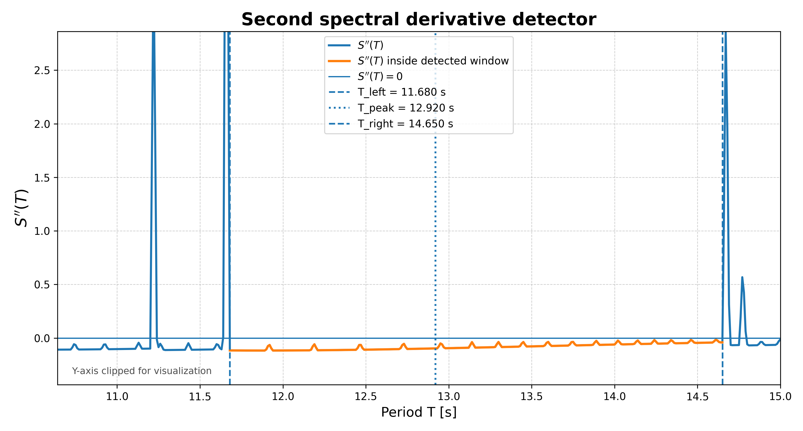

# SPECduration

SPECduration is an open-source Python package for estimating spectral seismic duration from displacement response spectra (DRS).

The software computes the displacement response spectrum of an earthquake acceleration record, automatically identifies the predominant spectral window using the second spectral derivative, and performs harmonic fitting within the detected window to estimate a spectral duration parameter.

SPECduration is designed for reproducible and non-interactive seismic record analysis. It avoids manual selection of the fitting interval and generates standardized numerical and graphical outputs for individual records or batch-processing workflows.

---

# Table of Contents

- [Scientific background](#scientific-background)
- [Features](#features)
- [Installation](#installation)
- [Usage](#usage)
- [Input format](#input-format)
- [Output structure](#output-structure)
- [Interpretation of results](#interpretation-of-results)
- [Methodological workflow](#methodological-workflow)
- [Reproducibility](#reproducibility)
- [License](#license)
- [Citation](#citation)

---

# Scientific background

The method implemented in SPECduration is based on the observation that displacement response spectra of pulse-type and near-fault ground motions may exhibit smooth harmonic-like regions around predominant spectral peaks.

This spectral behavior is approximated using the harmonic model:

$$
S(T) = A \left|\sin\left(\frac{\pi t_d}{T} + \varphi\right)\right|
$$

where:

- $S(T)$ is the displacement response spectrum;
- $A$ is the spectral amplitude;
- $t_d$ is the estimated spectral duration parameter;
- $T$ is the structural period;
- $\varphi$ is the phase parameter.

SPECduration implements this DRS-based spectral-duration estimation in the period domain. The software computes the displacement response spectrum $S(T)$, identifies the peak period $T_p$, and uses the second spectral derivative $S''(T)$ to detect the predominant negative-curvature region around the main spectral lobe. The internal limits of this region define the fitting window $[T_l,T_r]$.

The default workflow uses a damping ratio of 5% and a spectral resolution of:

$$
\Delta T = 0.01 \ \mathrm{s}
$$

This resolution is adopted to preserve the local DRS geometry required for second-derivative-based window detection.

---

# Features

- Displacement response spectrum computation using the Newmark-beta method.
- Automatic identification of the peak period $T_p$.
- Numerical computation of the first and second spectral derivatives, $S'(T)$ and $S''(T)$.
- Curvature-based detection of the predominant spectral window $[T_l,T_r]$.
- Harmonic fitting of the DRS within the detected window.
- Estimation of the spectral duration parameter $t_d$.
- Calculation of goodness-of-fit using $R^2$.
- Automatic validation of fitting results.
- Generation of user-friendly Excel output, reproducible CSV files, and diagnostic figures.
- Command-line interface for individual or batch-processing workflows.
- Deterministic analysis without manual window selection.

---

# Installation

## Requirements

- Python 3.9 or later
- Python 3.12 is recommended

## Install from source

Clone the repository and install the package from the project root directory:

```bash
git clone https://github.com/Lizandro-Jara/SPECduration.git
cd SPECduration
python -m pip install -e .
```

Alternatively, the repository can be downloaded as a ZIP file from GitHub. After extracting the folder, run the installation command from the project root directory, where `pyproject.toml` is located:

```bash
python -m pip install -e .
```

Using a virtual environment is recommended for a clean and reproducible installation.

---

## Usage

Run the software from the command line:

```bash
specduration --input "examples/ChiChi_Taichung78_90.txt" --out "outputs"
```

### Command-line options

- `--input`: path to the ground-motion record in `.txt` format.
- `--out`: output directory where result files and figures will be saved.
- `--no-plots`: run the analysis without generating figures.
- `--zeta`: damping ratio used to compute the DRS. Default: `0.05`.
- `--tmax`: maximum period for the DRS computation, in seconds. Default: `15.0`.
- `--dT`: spectral period step used to compute the DRS, in seconds. Default: `0.01`.
- `--min-points-window`: minimum number of points required in the detected spectral window. Default: `10`.
- `--min-points-fit`: minimum number of points required for the harmonic fit. Default: `10`.
- `--min-R2-fit`: minimum $R^2$ required to accept the harmonic fit. Default: `0.98`.
- `--no-extend-window`: disables automatic extension of the detected window when it has fewer points than required.

---

## Input format

The input file must be a plain-text file with two columns:

1. Time, in seconds.
2. Ground acceleration, in `m/s²`.

Example:

```text
t(s)    ag(m/s^2)
0.00    -0.00123
0.02     0.00345
0.04    -0.00210
...
```

---

## Output structure

For each processed record, SPECduration creates a dedicated output folder inside the directory specified with `--out`. The folder contains the main Excel report, reproducible CSV files, and diagnostic figures.

### Main output

- `results.xlsx`: main Excel report with organized sheets for summary results, DRS values, second-derivative data, and diagnostics.

The Excel report contains the following sheets:

- `Summary`: main estimated parameters and validation status.
- `DRS`: displacement response spectrum values.
- `SecondDerivative`: first and second spectral derivative values.
- `Diagnostics`: additional information from the window detection and fitting workflow.

### Additional CSV outputs

- `summary.csv`: compact summary of the estimated parameters and validation metrics.
- `results_diagnostics.csv`: detailed diagnostic information from the detection and fitting workflow.
- `drs_full.csv`: full displacement response spectrum values.
- `second_derivative.csv`: numerical derivative values used for window detection.

### Example output

Below is an example of the diagnostic outputs generated by **SPECduration** for a
near-fault ground-motion record.

#### Displacement Response Spectrum



#### Detected spectral window and harmonic fit



#### Second-derivative diagnostic plot



## Interpretation of results

The estimated parameter $t_d$ is a spectral-duration descriptor obtained from the predominant region of the displacement response spectrum.

It should be interpreted as a response-spectrum-based duration measure, not as a direct replacement for conventional time-domain duration metrics.

The value of $R^2$ indicates how well the harmonic model fits the detected DRS window. By default, a solution is considered valid when the fitting criteria are satisfied and:

$$
R^2 \geq 0.98
$$

---

## Methodological workflow

The workflow implemented in SPECduration consists of the following steps:

1. Load the earthquake acceleration record from a plain-text file.
2. Compute the displacement response spectrum $S(T)$ using the Newmark-beta method.
3. Identify the peak period $T_p$ from the maximum value of the DRS.
4. Compute the first and second numerical derivatives, $S'(T)$ and $S''(T)$.
5. Detect the predominant spectral window $[T_l,T_r]$ by identifying the negative-curvature region around $T_p$.
6. Fit the harmonic model inside the detected window:

$$
S(T) = A \left|\sin\left(\frac{\pi t_d}{T} + \varphi\right)\right|
$$

7. Estimate the spectral duration parameter $t_d$ and the goodness-of-fit value $R^2$.
8. Validate the result using the internal fitting and window-quality criteria.
9. Export tabular results and diagnostic figures.

---

## Reproducibility

SPECduration is designed for deterministic and reproducible analysis. Given the same input record, configuration, and software version, the package generates the same DRS, detected window, fitted parameters, validation status, and output figures.

The workflow avoids manual selection of the fitting window, supporting consistent analysis of individual or multiple ground-motion records.

---

## License

This project is released under the MIT License.

---

## Citation

If you use this software in academic work, please cite it using the information provided in the `CITATION.cff` file.